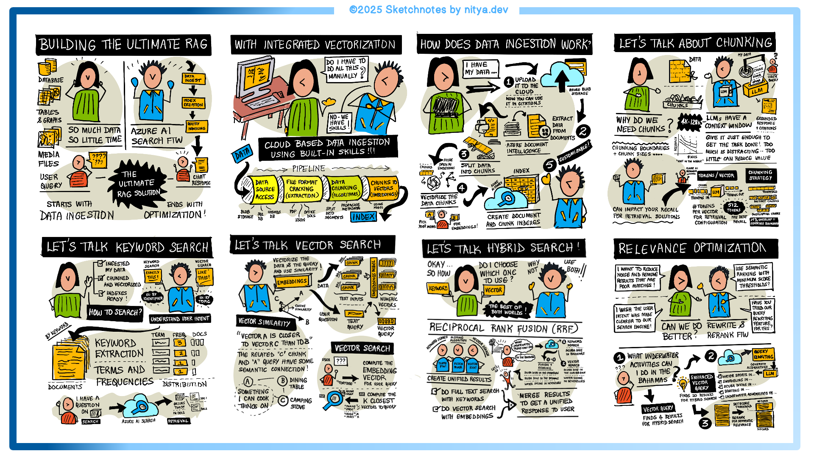

# Journey 2: Building the Ultimate Retrieval System for RAG

## Overview

Welcome to **Journey 2: Building the Ultimate Retrieval System for RAG**. This space is designed to help you understand how retrieval systems form the backbone of AI-powered applications.

In this journey, we explore how to set up and structure retrieval using Azure AI Search, covering essential components like data ingestion, keyword and vector search, hybrid search, and semantic ranking. You’ll learn how to choose the right techniques to ensure accurate and efficient retrieval, making AI applications more effective in delivering context-aware responses.

* **📺 [Watch the session](https://aka.ms/rag-time/journey2)**
* **📝 [Read the blog post](https://aka.ms/rag-time/journey2-blog)**
* **🚀 [Test the sample](./sample/)**

## 🎥 Session Summary

### 🎥 The Future of AI-Powered Retrieval

Retrieval is the foundation of AI’s ability to provide relevant and accurate responses. As AI applications scale, the ability to efficiently access, rank, and retrieve data becomes a critical factor in their success. Azure AI Search brings together vector search, hybrid search, and semantic ranking, offering developers a powerful way to integrate retrieval directly into their AI workflows. Understanding how these technologies work together enables more reliable, cost-effective, and high-performance search experiences.

### 📚 Designing the Ultimate Retrieval System

Building a retrieval system involves more than just storing data—it requires structuring, processing, and optimizing search techniques to ensure high relevance and efficiency. Data ingestion is the first step, transforming raw content into an indexed format that allows for rapid lookups. From there, retrieval strategies like keyword search, vector embeddings, and hybrid models determine how well the system understands and ranks information. Query optimization techniques, including semantic ranking and rewriting, further refine search accuracy, ensuring AI can return the most useful results to users.

### 🖍 Doodle Summary

A visual summary of key takeaways is available to reinforce learning.

## 📂 Sample Code

To get hands-on experience, explore the sample implementation in the 📂 [Journey 2 Sample](./sample/) folder.

## 🔗 Additional Learning Resources

- 📚 Azure AI Search Documentation: [Learn more](https://learn.microsoft.com/en-us/azure/search/)
- 📝 Read the Blog for Journey 2: [Build the Ultimate Retrieval System for RAG](https://aka.ms/rag-time/journey2-blog)
- 💬 Join the Discussion: Ask your questions on our [Discord channel](https://aka.ms/rag-time/discord)

### 🚀 Next Up: Continue to [Journey 3](./../Journey%203%20-%20Optimize%20your%20Vector%20Index%20for%20Scale) for the next step—Optimizing Your Vector Index for Scale!
