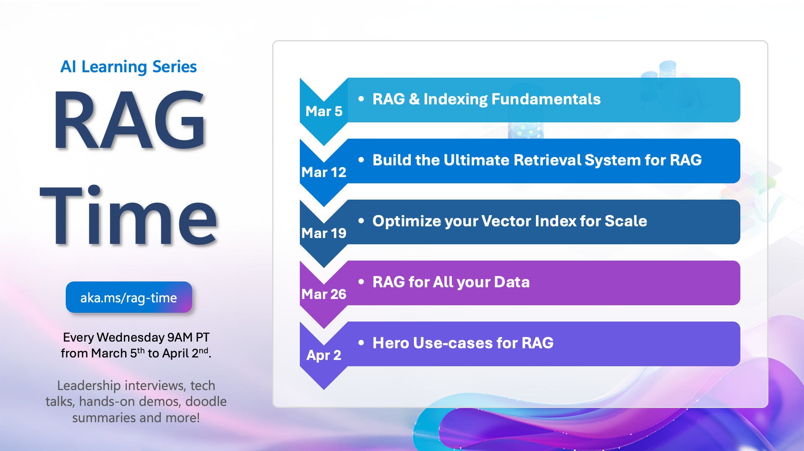
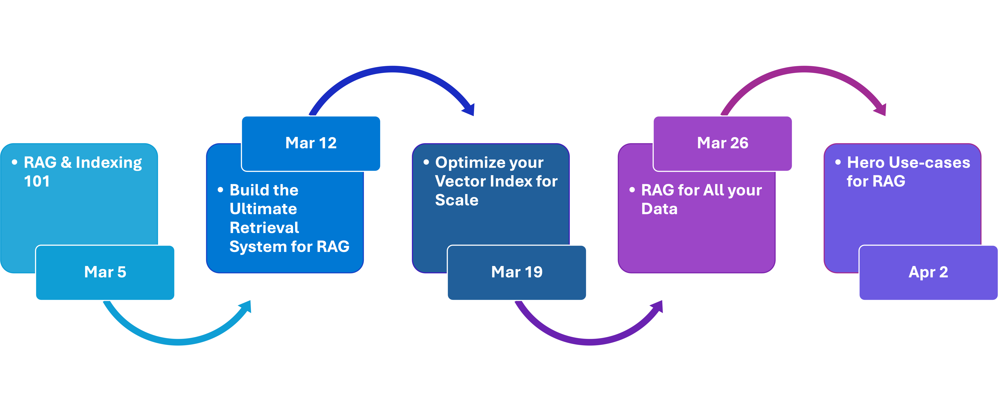

# RAG Time: Ultimate Guide to Mastering RAG




[](https://aka.ms/rag-time/calendar)


[](https://GitHub.com/microsoft/rag-time/watchers)
[](https://github.com/microsoft/rag-time/fork)
[](https://GitHub.com/microsoft/rag-time/stargazers)

[](https://discord.gg/REmjGvvFpW)

**🚀 Master RAG with RAG Time!** Learn how to build smarter AI applications with Retrieval-Augmented Generation. This repo includes **step-by-step guides, live coding samples, and expert insights**—everything you need to go from beginner to RAG pro!

## 🤔 Why Learn RAG with RAG Time?
- **Expert-Led** – Learn directly from AI & Microsoft experts.
- **Future-Proof Your AI Skills** – Stay ahead with cutting-edge retrieval techniques.
- **Exclusive Video Content** – Interviews with AI leaders, in-depth tech talks, and practical demonstrations.
- **Sample Code** – Follow along with ready-to-use implementations and best practices.
- **Doodles & Visual Explanations** – Complex concepts made simple with engaging visuals.
  
## 🚀 Get Started in 3 Easy Steps  

1. [Fork](https://github.com/microsoft/rag-time/fork) the repository.
2. Clone the repository to your local machine:
  ```bash
  git clone https://github.com/your-org/rag-time.git
  cd rag-time
  ```
3. Navigate to the Journey of your choice and follow the README Instructions.

## Learning Journeys
RAG Time runs every **Wednesday at 9AM PT** from **March 5th to April 2nd**. Each journey covers unique topics with leadership insights, tech talks, and code samples
| **Journey Page**                                                                                                             | **Description**                                                     | **Video**                                 | **Code Sample**                                                                 | **Blog**                                   |
|------------------------------------------------------------------------------------------------------------------------------|---------------------------------------------------------------------|-------------------------------------------|--------------------------------------------------------------------------------------------------------------------------------------------------|------------------------------------------------|
| [RAG and Knowledge Retrieval fundamentals](./Journey%201%20-%20RAG%20and%20Indexing%20Fundamentals/README.md)                           | Understand the strategic importance of RAG and indexing             | [Watch now](https://aka.ms/rag-time/journey1) | [Sample](./Journey%201%20-%20RAG%20and%20Indexing%20Fundamentals/sample/1-RAG-Fundamentals.ipynb)                                                | [Journey 1](https://aka.ms/rag-time/journey1-blog) |
| [Build the Ultimate Retrieval System](./Journey%202%20-%20Build%20the%20Ultimate%20Retrieval%20System%20for%20RAG/README.md) | Explore how Azure AI Search powers retrieval system                 | [Watch now](https://aka.ms/rag-time/journey2) | [Sample](./Journey%202%20-%20Build%20the%20Ultimate%20Retrieval%20System%20for%20RAG/sample/2-Build-The-Ultimate-Retrieval-System-For-RAG.ipynb) | [Journey 2](https://aka.ms/rag-time/journey2-blog)                                     |
| [Optimize Your Vector Index at Scale](./Journey%203%20-%20Optimize%20your%20Vector%20Index%20for%20Scale/README.md)          | Learn real-world optimization techniques for scaling vector indexes | [📺 Streaming on March 19th, 9AM PT](https://aka.ms/rag-time/journey3) | [Sample](./Journey%203%20-%20Optimize%20your%20Vector%20Index%20for%20Scale/sample/3-Vector-Compression.ipynb)                                   | Coming soon!                                     |
| [RAG for All Your Data](./Journey%204%20-%20RAG%20for%20All%20your%20Data%20Multimodal%20and%20Beyond/README.md)             | Discover how multimodal data can be indexed and retrieved           | [📺 Streaming on March 26th, 9AM PT](https://aka.ms/rag-time/journey4) | [Sample](./Journey%204%20-%20RAG%20for%20All%20your%20Data%20Multimodal%20and%20Beyond/sample/README.md)                                         | Coming soon!                                     |
| [Hero Use-Cases for RAG](./Journey%205%20-%20Hero%20use%20cases%20for%20RAG/README.md)                                       | Get inspired by hero use cases of RAG in action                     | [📺 Streaming on April 2nd, 9AM PT](https://aka.ms/rag-time/journey5) | [Sample](./Journey%205%20-%20Hero%20use%20cases%20for%20RAG/sample/README.md)                                                                    | Coming soon!                                     |
### Content Release Schedule




## 🙏 Get Involved

We'd love to see you contributing to our repo and engaging with the experts with your questions!
- 🤔 Do you have suggestions or have you found spelling or code errors? [Raise an issue](https://github.com/microsoft/rag-time/issues) or [Create a pull request](https://github.com/microsoft/rag-time/pulls).
- 🚀 If you get stuck or have any questions about RAG, join our [Azure AI Community Discord](https://discord.com/channels/1113626258182504448/1343540943533637663).

## Meet the RAG Time Speakers


## Contributing

This project welcomes contributions and suggestions. Most contributions require you to agree to a
Contributor License Agreement (CLA) declaring that you have the right to, and actually do, grant us
the rights to use your contribution. For details, visit https://cla.opensource.microsoft.com.

When you submit a pull request, a CLA bot will automatically determine whether you need to provide
a CLA and decorate the PR appropriately (e.g., status check, comment). Simply follow the instructions
provided by the bot. You will only need to do this once across all repos using our CLA.

This project has adopted the [Microsoft Open Source Code of Conduct](https://opensource.microsoft.com/codeofconduct/).
For more information, see the [Code of Conduct FAQ](https://opensource.microsoft.com/codeofconduct/faq/) or
contact [opencode@microsoft.com](mailto:opencode@microsoft.com) with any additional questions or comments.

## Trademarks

This project may contain trademarks or logos for projects, products, or services. Authorized use of Microsoft 
trademarks or logos is subject to and must follow 
[Microsoft's Trademark & Brand Guidelines](https://www.microsoft.com/en-us/legal/intellectualproperty/trademarks/usage/general).
Use of Microsoft trademarks or logos in modified versions of this project must not cause confusion or imply Microsoft sponsorship.
Any use of third-party trademarks or logos is subject to those third parties' policies.
